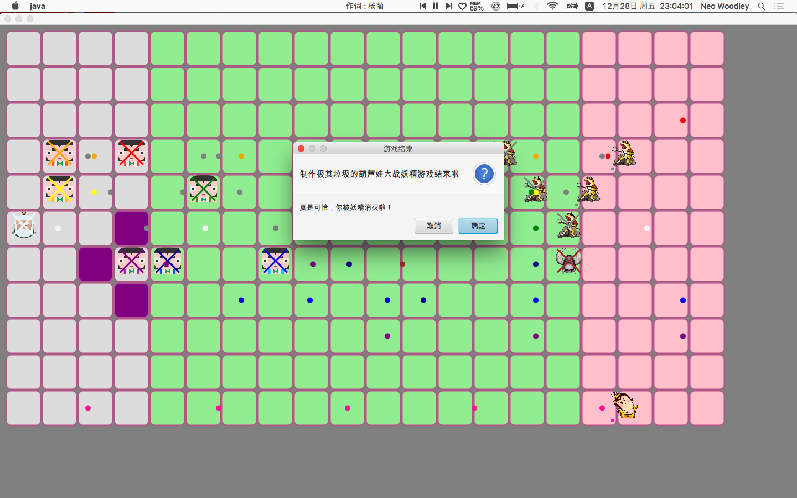

# 游戏界面说明

## 游戏初始化界面


## 游戏进行界面


点击葫芦娃，将会标记出葫芦娃所能移动到的小方格；点击被标记的小方格就能移动葫芦娃。

## 游戏结束界面



# 设计原则

## 单一职责原则

我尽可能地尝试着将不应该属于这个类的职责封装到另一个执行该职责更合适的类中，期望能达到当一个职责变化时，尽可能小的影响其他类的运作。

## 开放闭合原则

为了达到尽量在不修改原有代码的情况下进行扩展，我尝试着进行抽象化，设计了一个BaseObject抽象类。这样就只需要增加新的具体类来实现新的具体功能即可。在不修改已有代码的基础上扩展系统的功能，达到开闭原则的要求。

## 里氏替换原则

    所有引用基类（父类）的地方必须能透明地使用其子类的对象。

在引用BaseObject类的地方，都能使用它的子类对象进行替换。

# 关于类的设计

## canvas包

我为整个游戏应用创建了四个Canvas，分别是MapCanvas、PlayerCanvas、BulletCanvas、HPCanvas。它们具有相同的大小，但具有不同的层次。
其中PlayerCanvas持有MapCanvas、BulletCanvas、HPCanvas实例对象的引用，用于根据player的状态对mapCanvas、bulletCanvas、hpCanvas作出修改。

在PlayerCanvas类中会根据选定的阵型来在Map的特定位置中摆放player，使用如下的函数：  

```Java
public class PlayerCanvas extends Canvas {
	private void changeToCRANE_WING(List<? extends BasePlayer> basePlayers){
		...
	}
}
```

因为List不是协变，所以我尝试使用泛型，给这个函数传入参数`List<? extends BasePlayer> basePlayers`，这样传入`List<GoodPeople>`、`List<Demon>`就都能合法了。


## creatures包

### GoodPeopleEnum类

这和DemonEnum类相似，都是一个枚举类，里面定义了爷爷和葫芦娃们固定不变的“属性”：名字、对应的图片、对应的颜色等。

```Java
public enum GoodPeopleEnum {
    GrandPa("爷爷", 0, "/picture/爷爷1.png", Color.WHITESMOKE),
    BrotherOne("红娃", 1, "/picture/红大娃.png", Color.RED),
    BrotherTwo("橙娃", 2, "/picture/橙二娃.png", Color.ORANGE),
    BrotherThree("黄娃", 3, "/picture/黄三娃.png", Color.YELLOW),
    BrotherFour("绿娃", 4, "/picture/绿四娃.png", Color.GREEN),
    BrotherFive("青娃", 5, "/picture/青五娃.png", Color.DARKBLUE),
    BrotherSix("蓝娃", 6, "/picture/蓝六娃.png", Color.BLUE),
    BrotherSeven("紫娃", 7, "/picture/紫七娃.png", Color.PURPLE);

    final private String name;
    final private int rank;
    final private String imageName;
    final private Color color;
    ......
}
```

## object包

### BaseObject类

我设置了一个抽象类BaseObject，拥有一些基本的成员变量、成员方法，BasePlayer、BaseScene、Bullet分别是BaseObject的子类。


## helper包

在这个包中存放着一些游戏辅助的内容，比如用于判断游戏输赢的类、方向、坐标类.

### Judger类

这个类会根据所有的player的状态来判断游戏是否结束、输赢情况，从Judger类中可以获得游戏的赢家的情况，用于游戏结束界面上的显示。


### GameSetter、GameStarter、GameOver类

1.  Main函数入口会创建GameSetter的实例对象，完成一些游戏初始化的设定
2.  完成初始化设定后，GameSetter对象将会创建GameStarter的实例对象，开始进入正式的游戏环节。

## holder包

这是一个“容器”的集合，从名字可以看出GoodPeopleHolder存放着GoodPeople，DemonHolder存放着Demon，调用`getPlayers()`方法可以获得`List<BasePlayer>`

### Holder接口

这个接口定义了“容器们”所必须要实现的方法。


# 遇到的问题

1.  在一开始设计类的时候，思路还比较清晰；但是到后面，随着添加的功能增多，类与类之间的协作就变得复杂了起来，一些职能不能确定交给哪个类来做比较好；甚至出现了硬传参数的现象
2.  自己在一开始构思蓝图的时候，想的特别"完满"，等到要实现它们的时候，只想着怎么简单怎么来。
